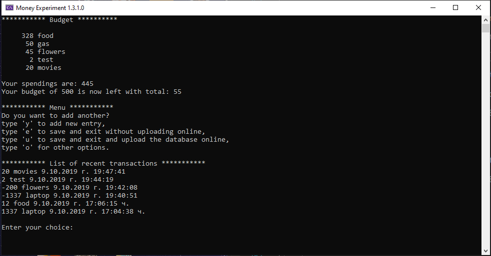

# MoneyExperiment

Experimental budgeting app.
Sync a budget between PCs with the help of public Git repo.
The trick is that your database of items is encrypted even if its in a public repo.

### How to Run:

* Install git as global app. (https://git-scm.com/downloads)
* If you want to build from source - Install dotnet core 3.0 (https://dotnet.microsoft.com/download/dotnet-core/3.0)
* Create empty folder and download and extract the latest version.
* Create new account and/or repository in [github.com](https://github.com/) or [gitlab.com](https://gitlab.com/). 
* Open Scripts/InitCreateDB.bat using your favorite text editor (notepad) and add change the lines of file to match your repo, for example: git config user.name "Krasen Ivanov"
git config user.email "krasen007@gmail.com"
and 
git remote add origin https://github.com/Krasen007/MoneyExperimentDB.git
* If building from, source open your folder with the app and open cmd/terminal and type "dotnet run".
* You are done! Enjoy your console .net core budgeting app.
* Optional: Repeat on any other PC you want to use the app on and synchronize your settings.

### How to use:

* After starting, the app will ask you to set a password. Remember this. It's used to encrypt your database.
* After that, it will ask you to set a name and amount of the budget. For example: Monthly Budget 1000, or Wedding Expenses 12500.
* The menu will appear. Use "y" to add entries. Enter how much you spent and on what.
* You can add new items and their balance will increase automatically if you type the same item. Use -amount to decrease costs. 
* When you are done you can save your current account database on your PC, or you can upload it to your git repo.
* If you want to use the app on another PC, install git and run CloneDB.bat after you set your git repo in the file as explained above.
* It should automatically sync your database. Remember to use the same password or you will not be able to open the database.
* In the options menu you have the ability to export the database to readable txt table, or import a budget.csv with "item, cost" format for example: "food, 50".

### Credits:

* Main coding: Krasen Ivanov 2019
* Icon made by Freepik from www.flaticon.com

#### TODO: